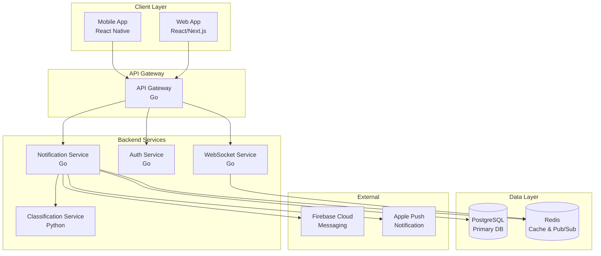

# Design Document

## Overview

NotiSync MVP is designed as a distributed system that enables real-time notification synchronization across multiple devices. The architecture follows a microservices pattern with clear separation between mobile clients, web clients, and backend services. The system prioritizes real-time performance, data consistency, and scalability while maintaining simplicity for the MVP scope.

## Architecture

### High-Level Architecture



### Communication Patterns

- **REST API**: Standard CRUD operations for user management, rules, and history
- **WebSocket**: Real-time notification sync and status updates
- **Redis Pub/Sub**: Inter-service communication and real-time event distribution
- **Push Notifications**: Fallback delivery when clients are offline

## Components and Interfaces

### 1. Mobile Application (React Native)

**Responsibilities:**
- Capture system notifications using native APIs
- Display synchronized notifications from other devices
- Provide user interface for rules management and history
- Maintain WebSocket connection for real-time sync

**Key Interfaces:**
```typescript
interface NotificationCapture {
  captureSystemNotification(notification: SystemNotification): Promise<void>
  requestNotificationPermissions(): Promise<boolean>
}

interface NotificationDisplay {
  showSyncedNotification(notification: SyncedNotification): void
  updateNotificationStatus(id: string, status: NotificationStatus): void
}
```

### 2. Web Application (React/Next.js)

**Responsibilities:**
- Display notifications received from mobile devices
- Provide comprehensive notification management interface
- Handle user interactions and sync actions back to mobile
- Implement responsive design for desktop and tablet use

**Key Interfaces:**
```typescript
interface WebNotificationManager {
  displayNotification(notification: SyncedNotification): void
  handleNotificationAction(id: string, action: NotificationAction): void
  requestBrowserPermissions(): Promise<boolean>
}
```

### 3. Notification Service (Go)

**Responsibilities:**
- Process incoming notifications from mobile clients
- Apply user-defined rules and categorization
- Coordinate with classification service for smart categorization
- Manage notification lifecycle and history
- Handle cross-device synchronization

**Key Interfaces:**
```go
type NotificationService interface {
    ProcessNotification(ctx context.Context, req *ProcessNotificationRequest) (*ProcessNotificationResponse, error)
    SyncNotificationAction(ctx context.Context, req *SyncActionRequest) error
    GetNotificationHistory(ctx context.Context, req *HistoryRequest) (*HistoryResponse, error)
    GenerateDailyDigest(ctx context.Context, userID string) (*DigestResponse, error)
}
```

### 4. Classification Service (Python)

**Responsibilities:**
- Analyze notification content for automatic categorization
- Apply machine learning models for Work/Personal/Junk classification
- Learn from user feedback to improve classification accuracy
- Handle keyword-based rule matching

**Key Interfaces:**
```python
class ClassificationService:
    def classify_notification(self, notification: NotificationData) -> ClassificationResult
    def update_classification_model(self, feedback: UserFeedback) -> None
    def apply_keyword_rules(self, notification: NotificationData, rules: List[Rule]) -> RuleResult
```

### 5. WebSocket Service (Go)

**Responsibilities:**
- Maintain persistent connections with all client devices
- Broadcast notification updates in real-time
- Handle connection management and reconnection logic
- Implement message queuing for offline devices

**Key Interfaces:**
```go
type WebSocketService interface {
    BroadcastToUser(userID string, message *SyncMessage) error
    HandleConnection(conn *websocket.Conn, userID string) error
    QueueMessageForOfflineDevice(deviceID string, message *SyncMessage) error
}
```

## Data Models

### Core Data Structures

```sql
-- Users table
CREATE TABLE users (
    id UUID PRIMARY KEY DEFAULT gen_random_uuid(),
    email VARCHAR(255) UNIQUE NOT NULL,
    password_hash VARCHAR(255) NOT NULL,
    created_at TIMESTAMP DEFAULT NOW(),
    updated_at TIMESTAMP DEFAULT NOW()
);

-- Devices table
CREATE TABLE devices (
    id UUID PRIMARY KEY DEFAULT gen_random_uuid(),
    user_id UUID REFERENCES users(id) ON DELETE CASCADE,
    device_name VARCHAR(255) NOT NULL,
    device_type VARCHAR(50) NOT NULL, -- 'mobile', 'web', 'desktop'
    push_token VARCHAR(512),
    last_seen TIMESTAMP DEFAULT NOW(),
    created_at TIMESTAMP DEFAULT NOW()
);

-- Notifications table
CREATE TABLE notifications (
    id UUID PRIMARY KEY DEFAULT gen_random_uuid(),
    user_id UUID REFERENCES users(id) ON DELETE CASCADE,
    source_device_id UUID REFERENCES devices(id),
    app_name VARCHAR(255) NOT NULL,
    title VARCHAR(500),
    body TEXT,
    category VARCHAR(50) DEFAULT 'Personal', -- 'Work', 'Personal', 'Junk'
    priority INTEGER DEFAULT 0,
    is_read BOOLEAN DEFAULT FALSE,
    is_dismissed BOOLEAN DEFAULT FALSE,
    created_at TIMESTAMP DEFAULT NOW(),
    expires_at TIMESTAMP DEFAULT (NOW() + INTERVAL '7 days')
);

-- User rules table
CREATE TABLE user_rules (
    id UUID PRIMARY KEY DEFAULT gen_random_uuid(),
    user_id UUID REFERENCES users(id) ON DELETE CASCADE,
    rule_name VARCHAR(255) NOT NULL,
    rule_type VARCHAR(50) NOT NULL, -- 'app_filter', 'keyword_filter', 'time_based'
    conditions JSONB NOT NULL,
    actions JSONB NOT NULL,
    is_active BOOLEAN DEFAULT TRUE,
    created_at TIMESTAMP DEFAULT NOW()
);

-- Notification actions table (for sync tracking)
CREATE TABLE notification_actions (
    id UUID PRIMARY KEY DEFAULT gen_random_uuid(),
    notification_id UUID REFERENCES notifications(id) ON DELETE CASCADE,
    device_id UUID REFERENCES devices(id),
    action_type VARCHAR(50) NOT NULL, -- 'read', 'dismissed', 'clicked'
    timestamp TIMESTAMP DEFAULT NOW()
);
```

### Redis Data Structures

```redis
# Real-time notification sync
SET notification:{notification_id}:status "{\"read\": true, \"dismissed\": false}"
EXPIRE notification:{notification_id}:status 604800  # 7 days

# User device connections
SADD user:{user_id}:devices "{device_id}"
SET device:{device_id}:connection "{\"socket_id\": \"abc123\", \"last_ping\": 1234567890}"

# Message queues for offline devices
LPUSH device:{device_id}:queue "{\"type\": \"notification_sync\", \"data\": {...}}"

# Daily digest cache
SET user:{user_id}:digest:2024-01-15 "{\"total_notifications\": 45, \"categories\": {...}}"
EXPIRE user:{user_id}:digest:2024-01-15 86400  # 24 hours
```

## Error Handling

### Error Categories and Responses

1. **Authentication Errors (401)**
   - Invalid credentials
   - Expired tokens
   - Device not registered

2. **Authorization Errors (403)**
   - Device access revoked
   - User account suspended

3. **Validation Errors (400)**
   - Invalid notification format
   - Missing required fields
   - Rule configuration errors

4. **Service Errors (500)**
   - Database connection failures
   - Classification service unavailable
   - WebSocket connection issues

### Retry and Fallback Strategies

```go
type RetryConfig struct {
    MaxRetries    int
    BackoffFactor float64
    MaxBackoff    time.Duration
}

// Notification sync retry logic
func (s *NotificationService) syncWithRetry(ctx context.Context, notification *Notification) error {
    config := RetryConfig{
        MaxRetries:    3,
        BackoffFactor: 2.0,
        MaxBackoff:    30 * time.Second,
    }
    
    return retry.Do(func() error {
        return s.syncNotification(ctx, notification)
    }, config)
}
```

### Graceful Degradation

- **Classification Service Down**: Fall back to keyword-based categorization
- **WebSocket Unavailable**: Use push notifications for critical updates
- **Database Issues**: Cache operations in Redis with eventual consistency
- **Network Connectivity**: Queue operations locally and sync when reconnected

## Testing Strategy

### Unit Testing

**Backend Services (Go)**
- Test notification processing logic
- Validate rule application algorithms
- Mock external dependencies (database, Redis)
- Test WebSocket connection handling

**Mobile App (React Native)**
- Test notification capture functionality
- Validate UI component behavior
- Mock native notification APIs
- Test offline/online state handling

**Web App (React/Next.js)**
- Test notification display components
- Validate user interaction handling
- Test WebSocket connection management
- Test responsive design across devices

### Integration Testing

**API Integration**
- Test complete notification flow from mobile to web
- Validate real-time sync across multiple devices
- Test authentication and authorization flows
- Verify rule application end-to-end

**Database Integration**
- Test data persistence and retrieval
- Validate foreign key constraints
- Test automatic cleanup of expired notifications
- Verify transaction handling

### End-to-End Testing

**Cross-Device Scenarios**
- Send notification on mobile, verify receipt on web
- Dismiss notification on web, verify sync to mobile
- Test offline/online synchronization
- Validate rule application across devices

**Performance Testing**
- Load test WebSocket connections (1000+ concurrent users)
- Test notification processing throughput
- Validate database query performance
- Test Redis cache hit rates

### Testing Tools and Frameworks

- **Go**: `testify` for assertions, `gomock` for mocking
- **React Native**: Jest, React Native Testing Library
- **React/Next.js**: Jest, React Testing Library, Cypress for E2E
- **Database**: `testcontainers` for integration tests
- **Load Testing**: `k6` for performance testing

## Security Considerations

### Authentication and Authorization

- JWT tokens with short expiration (15 minutes) and refresh token rotation
- Device-specific tokens that can be individually revoked
- Rate limiting on authentication endpoints (5 attempts per minute)

### Data Protection

- Notification content encrypted at rest using AES-256
- TLS 1.3 for all client-server communication
- Redis AUTH and encrypted connections
- Database connection encryption

### Privacy Controls

- Automatic notification expiration (7 days)
- User-controlled data deletion
- Opt-out mechanisms for sensitive app notifications
- No logging of notification content in application logs

## Performance Optimization

### Caching Strategy

- Redis caching for frequently accessed user rules
- Notification status cached for real-time sync
- Daily digest results cached for 24 hours
- Database query result caching with TTL

### Database Optimization

- Indexes on frequently queried columns (user_id, created_at, category)
- Partitioning notifications table by date for efficient cleanup
- Connection pooling with appropriate limits
- Read replicas for notification history queries

### Real-time Performance

- WebSocket connection pooling and load balancing
- Message batching for high-frequency updates
- Compression for large notification payloads
- Circuit breaker pattern for external service calls